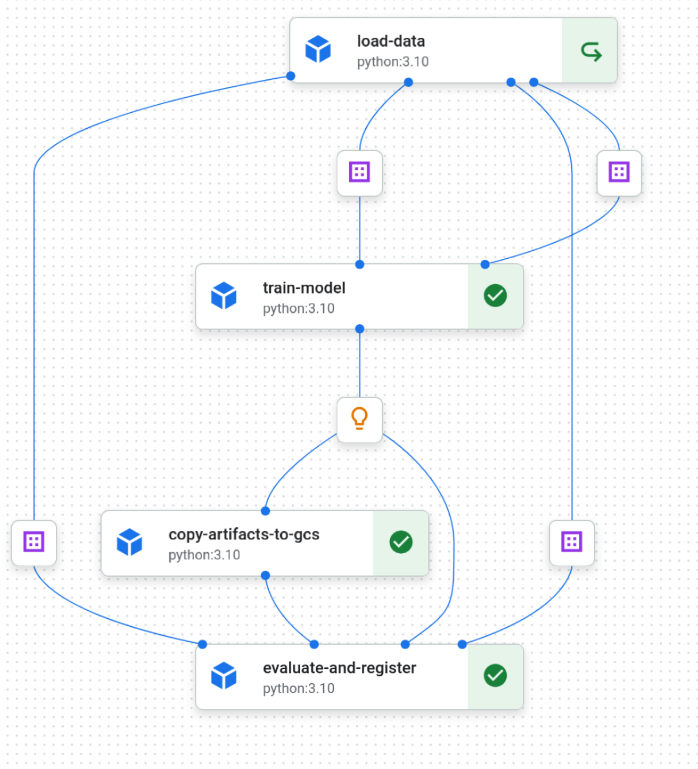

# House price prediction with predictive ML

## Project architecture

This project uses scikit-learn and Kubeflow pipelines to build a training pipeline that is registered to Vertex AI.
The idea is that this pipeline will run based on fresh data that is pointed to a GCP Storage bucket, and if the fresh data 
presents a higher RMSE value than the previous one, it will automatically register a new version for the model as an API on Vertex AI.


All of this is managed by GCP, with the added flexibility of being a Kubeflow pipeline, so apart from the model registry logic that currently uses `google.cloud.aiplatform`, it can be deployed to a cloud-agnostic Kubernetes cluster with a little more effort.

## Machine Learning development
This model aims to predict the house prices in US dollars, and the exploration to find its first version is located at `analysis/eda.ipynb`.
I have downloaded the `train.csv` file locally and placed it under `{PROJECT_ROOT}/data`.
For a production use-case, this would likely be placed on a cloud storage solution, which is what is used for the Kubeflow training pipeline.

## The prediction API endpoint

You can access the endpoint Swagger Docs on this [link](https://house-model-app-954208583758.us-central1.run.app/docs).
There is a documentation on how to make the `/predict` request inside it, but of course normal `curl` requests will also work to the root URL.

| Endpoint  | Method | Description   | Request Body | Response                                   |
|-----------|--------|---------------|-----------------------------|--------------------------------------------|
| `/health` | `GET`  | Health Check  | None                        | 200: Successful Response (Empty JSON)      |
| `/predict`| `POST` | Predict       | JSON: `RequestFeatures`     | 200: Successful Response (Prediction) <br> 422: Validation Error (if input is invalid) |

>**NOTE**: I have set the minimum replicas to 0 on this deployment, so the first time you hit it, it might 
> take some to respond time due to the cold start.

## ML Lifecycle
### 1. Training Pipeline
The first step is to compile the Kubeflow pipeline and submit it using the Vertex AI SDK:
```bash
PYTHONPATH="$PYTHONPATH:$PWD" GOOGLE_APPLICATION_CREDENTIALS="path/to/svc-account.json" python3 src/run.py
```

The code will generate a local `regression_pipeline.json` file that will also be submitted as a Vertex AI pipeline to your existing GCP account.
For this command to run successfully you will need a Service Account Keys file with the following permissions:

- Compute Engine Service Agent
- Service Account Token Creator
- Service Usage Consumer
- Storage Object Admin
- Vertex AI Service Agent
- Vertex AI User 




#### Steps description
| Step                    | Description                                                                                                                     | Inputs           | Outputs                          |
|-------------------------|---------------------------------------------------------------------------------------------------------------------------------|------------------|----------------------------------|
| `load-data`             | Loads the data from GCS, splits into `X, y` (features and target) and applies a log transformation to `y`                       | -                | X_train, y_train, X_test, y_test |                                                                                  |                                                                                       | 200: Successful Response (Empty JSON)                                                  |
| `train-model`           | Creates an sklearn pipeline that fits a preprocessor for categorical and numerical features, and then trains a LinearRegressor. | X_train, y_train | Model                            |
| `copy-artifacts-to-gcs` | Copies the model artifact from the transient GCS location to a fixed one that will also be used for the predictions API.        | Model            | -                                |
| `evaluate-and-register`  | Evaluates the model performance with `X_test, y_test` and                                                                       | X_test, Y_test   | -                                |


You can access a successful Vertex pipeline run [here](https://console.cloud.google.com/vertex-ai/pipelines/locations/us-central1/runs/regression-pipeline-20250223192413?inv=1&invt=AbqYCg&project=level-agent-451514-c0)

### 2. Deploying the REST API container to Cloud Run
To deploy the REST container, you can run: 
```bash
cd src/terraform
terraform init
terraform plan # check if it's doing what it's supposed to do
terraform apply
```
After this is successful, another API endpoint will be deployed to the existing infrastructure.

#### Why Cloud Run?
I have decided to use Cloud Run, a managed containers service from GCP, as the engine for the REST API to be deployed on.
Even though Vertex has its own ways to auto-deploy models based on existing `.pkl` files, I've found it way less intuitive
if anything more custom needs to be done, and the entire codebase ends up being too vendor-locked.

### Model Monitoring
Currently, the pipeline is making a data validation with the OSS [whylogs](https://github.com/whylabs/whylogs/tree/mainline) to check on the model's target column: `SalePrice` to check if the count of nulls
is over a threshold, and also check if there are no negative values. This ensures that our training will make sense with real-world data, while not
putting any complex infrastructure to support that.
On a real world scenario, these constraints will change over time, and it is a good idea to keep it version controlled.
It would eventually evolve into its own validation step on the Kubeflow pipeline, and could even happen in parallel, depending on how much performance we would want to gain.

`whylogs` is a great choice because its nature allows for it to scale even for distributed map-reduce processing tools, such as Apache Spark. So this approach makes sense even for larger scoped scenarios

For a real-world use case, we could also plug in whylogs' functionalities to compare predictions to ground truth, on a separate Kubeflow pipeline. This could run on a cadence, and be setup to trigger alerts in case performance is degraded.
But there are so many infra and customer specific decisions to be made, that it felt a little out of the scope for this project to be included here as well.

### (Optional) Deploying KF Pipelines with Minikube + Docker

An alternative is to run the pipeline project entirely on your machine, for which you will need a Kubeflow pipelines component running locally.
We can do that by deploying it using Minikube, which emulates a real-world Kubernetes environment on the local machine,
and then use docker as the underlying engine to spin up the cluster.

Local deployment of kubeflow following: https://www.kubeflow.org/docs/components/pipelines/operator-guides/installation/
Then port forwarding to 8080 we get

`kubectl port-forward -n kubeflow svc/ml-pipeline-ui 8080:80` 

>**NOTE**: I had an issue with Kubeflow's proxy agent since it was trying to resolve for a GKE deployment
>(probably for using Minikube), so I disabled it by scaling its pods to 0 replicas `kubectl scale deployment proxy-agent -n kubeflow --replicas=0`  


## Simplifications
- I have decided to put the data under a GCS bucket, that will be the same bucket that is used for the pipeline to persist its artifacts
- The REST API endpoint is unprotected, in order to simplify the demo for this project 
  - in my view, a prod-ready authentication would increase the development time for a significant amount, which would require setting up VPCs, a dedicated Identity Aware Proxy and would consume too much from the scope of this project
- The pipeline is currently not active and listening to GCS, which would be a nice addition
- The model is not monitored for predictions, which would require a few assumptions around how often we will get the ground truth, monitoring alert strategies, and other concerns that felt a little out of the scope of this demo.
- I haven't done any kind of optimization for the model performance, such as an enhanced feature selection, hyperparameter tuning, benchmarking with other models, etc. beyond the exploration phase. My focus was on the MLOps end, which was already quite tricky to get right.
- I have generated a local image of the Docker container, pushed it to GCP and used that as the base image for the predictions' container.
  - Since the container will download the respective model version on startup, the core logic will rarely change, so automation on this step felt unnecessary at this point in time 

## Challenges faced
- As this was my first project with Vertex AI and Kubeflow, I had a lot to learn in a short period of time
- Authentication was especially hard, given that even with a Service Account, Vertex has its own ways to authenticate (through a Service Agent) with little to no useful error logs, so ramping up took most of the project time.
- Found it hard to modularize Kubeflow components code, as each pipeline step is its own self-contained container execution, which needs to have all the logic
needed to run the code without imports. Could probably be solved by decoupling the model code into a python package, but it would add extra complexity out of the scope of this project case.
- Although I managed to deploy the Kubeflow Pipelines as a standalone app locally, the UI is pretty unstable and I could not get it 
to a seamless local development experience. Given a little more time and effort, that would **dramatically** speed up development without having to send anything to GCP at all.